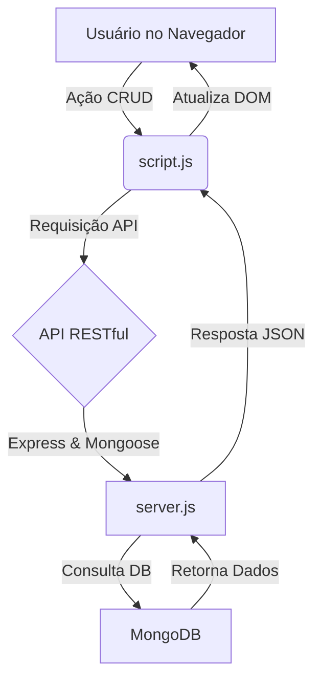

# Apollonia Dental Practice: Gestão de Funcionários & Departamentos (CRUD)


---

### **Índice**
* [📝 Descrição do Projeto](#-descrição-do-projeto)
* [⚙️ Tecnologias Utilizadas](#-tecnologias-utilizadas)
* [📁 Estrutura do Projeto](#-estrutura-do-projeto)
* [🔄 Fluxo de Funcionamento](#-fluxo-de-funcionamento)
* [🚀 Funcionalidades e Demonstração](#-funcionalidades-e-demonstração)
* [💻 Como Usar a Aplicação](#-como-usar-a-aplicação)
* [👥 Equipe do Projeto](#-equipe-do-projeto)
* [✅ Conclusão](#-conclusão)
* [📸 Prévia do Projeto](#-prévia-do-projeto)

---

### 📝 **Descrição do Projeto**

Este aplicativo web **CRUD (Create, Read, Update, Delete)** fundamental foi desenvolvido para a **Apollonia Dental Practice**, com o objetivo de digitalizar a gestão de seus funcionários e departamentos. O projeto serve como a **base de dados** inicial para um futuro sistema de CRM (Customer Relationship Management).

O aplicativo permite a inserção, visualização, edição e exclusão de registros de funcionários, mantendo um vínculo obrigatório com os departamentos da clínica.

#### ⚙️ **Tecnologias Utilizadas**
| Categoria | Tecnologia | Descrição |
| :--- | :--- | :--- |
| **Backend** | Node.js | Ambiente de execução JavaScript do lado do servidor. |
| | Express.js | Framework para criação da API RESTful. |
| **Banco de Dados** | MongoDB | Banco de dados NoSQL utilizado para persistência dos dados. |
| | Mongoose | Biblioteca de modelagem de objetos e gerenciamento de relacionamento entre coleções. |
| **Frontend** | HTML5 | Estrutura e formulários da interface de usuário. |
| | CSS3 | Estilização para uma experiência de usuário profissional. |
| | JavaScript | Lógica de comunicação assíncrona com a API (`fetch`/Ajax). |
| **DevOps/Ambiente** | Docker | Empacotamento do ambiente completo (App + DB) para implantação simplificada. |

#### 📁 **Estrutura do Projeto**

```
gestao-apollonia/
├── public/                 # Frontend (HTML, CSS, JS)
│   ├── index.html          # Interface principal
│   ├── style.css           # Estilos
│   └── script.js           # Lógica do CRUD (Comunicação com API)
├── .env                    # Variáveis de ambiente (usado em desenvolvimento local)
├── Dockerfile              # Receita para construir a imagem do Node.js
├── docker-compose.yml      # Orquestração (Node.js App e MongoDB DB)
├── seed.js                 # Script para popular o DB com dados iniciais da clínica
└── server.js               # Backend: Servidor Express, Modelos e Rotas CRUD
```
#### 🔄 **Fluxo de Funcionamento**


### 🚀 **Funcionalidades e Demonstração**

#### **Principais Funcionalidades**
* **Gestão de Funcionários (CRUD Completo):** Criação, Leitura, Atualização e Exclusão de registros de funcionários.
* **Gestão de Departamentos:** Armazenamento e listagem de 5 departamentos da clínica.
* **Relacionamento de Dados:** Funcionários são obrigatoriamente vinculados a um departamento através de IDs, e o frontend exibe o nome do departamento graças ao `.populate` do Mongoose.
* **Validação de Dados:** Campos obrigatórios garantem a qualidade dos dados.

#### **Dados Iniciais Carregados**
Para iniciar a aplicação, o script `seed.js` carregou automaticamente:
* **10 Funcionários** (ex: Lisa Harris, Alfred Christensen, Janet Doe).
* **5 Departamentos** (ex: General Dentistry, Pediatric Dentistry, Surgery).

---

### 💻 **Como Usar a Aplicação**

O ambiente é 100% conteinerizado com Docker.

**Pré-requisitos:**
* **Docker** e **Docker Compose** instalados.

**Passos para Execução:**

1.  **Clone o Repositório e Navegue:**
    ```bash
    git clone https://github.com/amaro-netto/gestao-funcionarios.git
    cd gestao-apollonia
    ```

2.  **Suba os Containers (App + DB):**
    Este comando constrói a imagem do Node.js e inicia o Node.js e o MongoDB:
    ```bash
    docker-compose up --build -d
    ```
    *(Nota: O app está mapeado para a porta **3001** no seu host, conforme ajustado.)*.

3.  **Execute a População Inicial (Seeding):**
    Isso insere os dados iniciais da Apollonia Dental Practice no MongoDB:
    ```bash
    docker exec apollonia-app npm run seed
    ```

4.  **Acesse a Aplicação:**
    Abra seu navegador e acesse: `http://localhost:3001`
    *(A lista de funcionários e o dropdown de departamentos devem estar preenchidos)*.

5.  **Para Parar a Aplicação:**
    ```bash
    docker-compose down
    ```

---

### 👥 **Equipe do Projeto**
<a href="https://github.com/amaro-netto" title="Amaro Netto"></a>
---

### ✅ **Conclusão**

Este projeto é uma implementação sólida de um aplicativo web Full-Stack, cumprindo os objetivos da Apollonia Dental Practice. O uso de tecnologias modernas como **Node.js, MongoDB** e **Docker** demonstra proficiência na construção e entrega de soluções escaláveis e portáteis. O projeto está pronto para ser a base do futuro sistema de gestão da clínica.

---

### 📸 **Prévia do Projeto**


